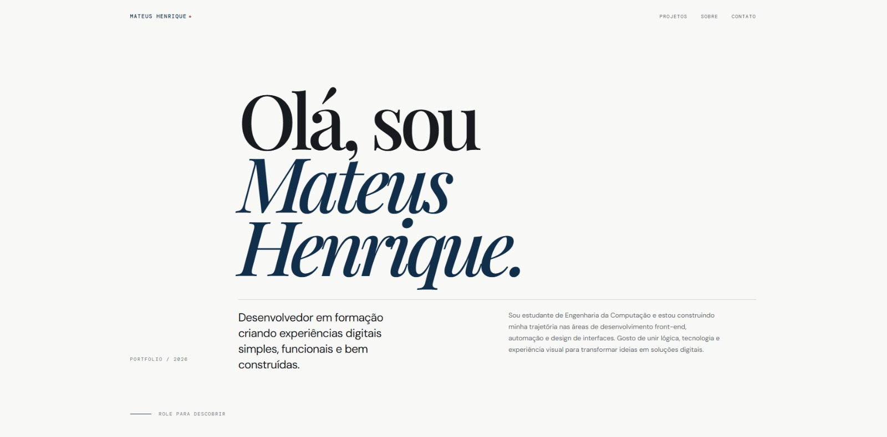
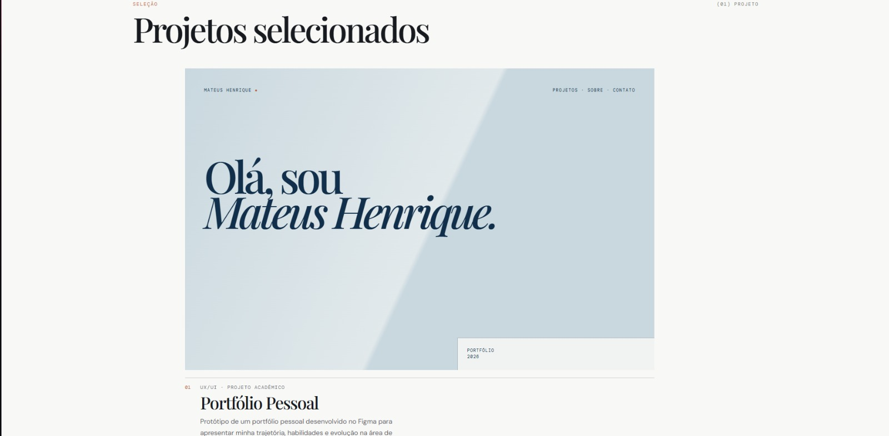
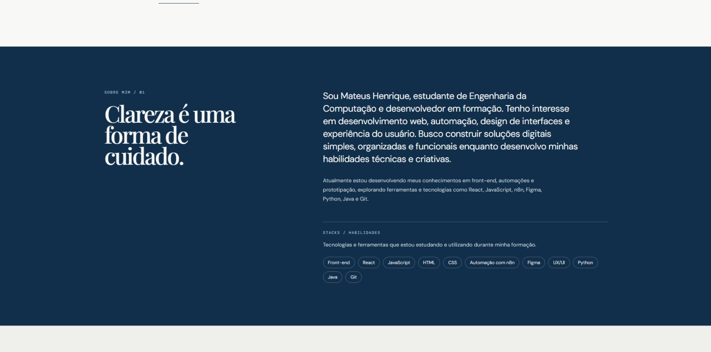
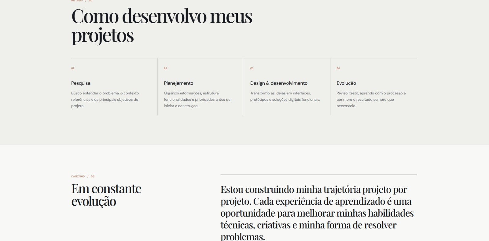
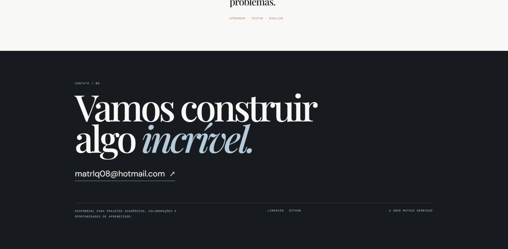

# Portfólio Pessoal — Mateus Henrique

Projeto acadêmico desenvolvido para a trilha **Front-end | Design de Experiência**, com foco na criação e prototipação de um portfólio pessoal utilizando o **Figma**.

O portfólio foi criado para apresentar minha trajetória, habilidades e evolução na área de tecnologia de forma clara, organizada e visualmente consistente.

## Projeto

Como ainda estou construindo meus primeiros projetos, utilizei o próprio desenvolvimento deste portfólio como meu primeiro projeto acadêmico.

A proposta foi criar uma interface que pudesse evoluir junto com minha formação, permitindo adicionar novos projetos e experiências ao longo do tempo.

### Acesse o portfólio

[Visualizar o portfólio publicado](https://luxury-etch-26505234.figma.site)

[Visualizar a página individual do projeto](https://luxury-etch-26505234.figma.site/projetos/portfolio-pessoal)

## Estrutura

O portfólio contém:

- apresentação pessoal;
- seção sobre mim;
- stacks e habilidades;
- projeto em destaque;
- página individual do projeto;
- processo de desenvolvimento;
- seção sobre evolução e aprendizado;
- contato.

## Objetivo

O objetivo foi desenvolver uma experiência de portfólio simples, moderna e organizada, capaz de apresentar minha identidade e meu momento atual de formação.

Além da parte visual, o projeto foi pensado para trabalhar organização de conteúdo, hierarquia de informações e navegação entre as telas.

## Ferramentas e conceitos utilizados

Na construção do projeto foram utilizados:

- Figma;
- Figma Make;
- UX/UI Design;
- prototipação;
- design responsivo;
- hierarquia visual;
- tipografia;
- composição;
- organização de conteúdo.

## Tecnologias em aprendizado

Também fazem parte da minha formação:

- HTML;
- CSS;
- JavaScript;
- React;
- n8n;
- Python;
- Java;
- Git.

## Processo de desenvolvimento

O processo foi organizado em quatro etapas.

### 1. Pesquisa

Busca por referências visuais, entendimento da proposta e definição dos principais objetivos do portfólio.

### 2. Planejamento

Organização das informações, definição das seções e estruturação do conteúdo.

### 3. Design e desenvolvimento

Definição da identidade visual, tipografia, cores, composição e prototipação das telas no Figma.

### 4. Evolução

Revisão do conteúdo, testes de navegação e refinamento da experiência visual.

## Aprendizados

Durante o desenvolvimento do projeto, pratiquei conceitos de:

- hierarquia visual;
- tipografia;
- composição;
- organização de conteúdo;
- prototipação;
- navegação entre telas;
- design responsivo;
- experiência do usuário.

## Telas do projeto

### Página inicial



### Projetos selecionados



### Sobre mim e habilidades



### Processo de desenvolvimento



### Contato



## Estrutura do repositório

```text
portfolio-pessoal/
├── README.md
└── images/
    ├── home.png
    ├── projetos.png
    ├── sobre-mim.jpeg
    ├── processo.jpeg
    └── contato.jpeg
```

---

Desenvolvido por **Mateus Henrique**.
